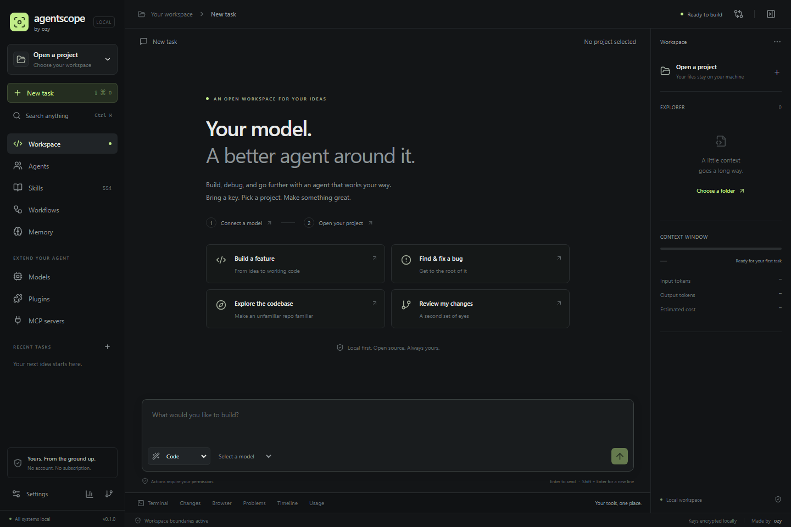
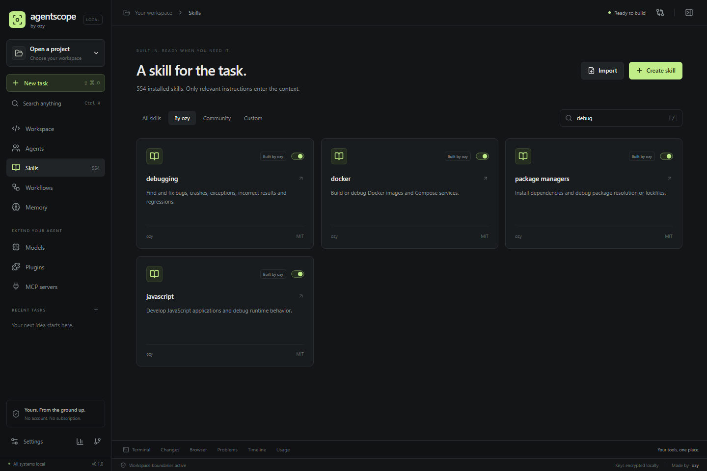
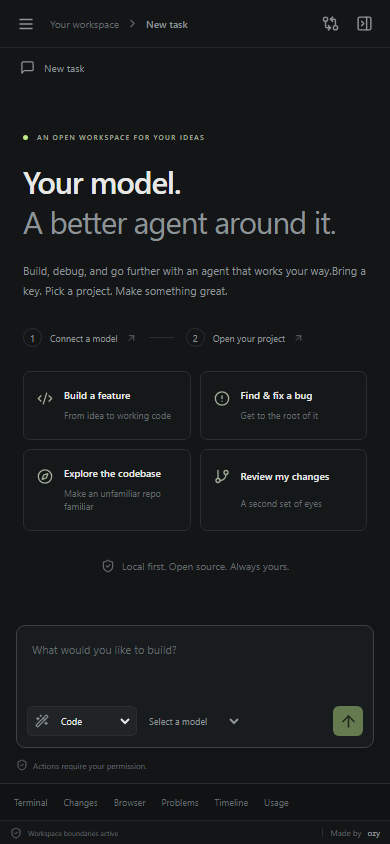

# AgentScope

**Your model. A better agent around it.**

AgentScope is an open-source, local-first AI agent workspace that lets you bring your own model and API keys while giving the model a powerful coding and automation environment.

Instead of locking you into one AI provider, AgentScope connects different models to the same agent system, tools, skills, workspace, permissions, memory, workflows, and project context.

> Built by ozy.



## Why AgentScope?

Most AI coding tools combine the model and the agent into one product.

AgentScope separates them.

You choose the model.

AgentScope provides the agent around it.

That means you can switch providers without losing the tools and workflow that make the model useful.

## Features

### Bring your own AI

AgentScope supports:

- OpenAI
- Anthropic
- Google Gemini
- OpenRouter
- Ollama
- OpenAI-compatible APIs
- Custom API endpoints
- Custom models

You can configure multiple providers and models and switch between them depending on the task.

### Four Agent Modes

AgentScope includes four execution modes:

| Mode | Purpose |
| --- | --- |
| Ask | Read-only questions, repository analysis, and research |
| Code | Make focused changes to your project |
| Agent | Let the model use the available tools to complete larger tasks |
| Workflow | Execute structured multi-step workflows |

### Real Coding Tools

Models can work directly with your project using permission-controlled tools.

AgentScope includes tools for:

- Repository search
- Project mapping
- Reading files
- Creating files
- Replacing code
- Applying patches
- Deleting and moving files
- Running terminal commands
- Inspecting terminal sessions
- Git status and diffs
- Git branches
- Staging files
- Commits
- Pushes
- Web fetching
- Browser automation
- Memory
- Skills
- MCP servers
- Delegated agents

Tools are dynamically exposed when relevant instead of dumping every tool into every request.

### Permission System

AgentScope does not silently give an AI unlimited access to your computer.

Sensitive actions pass through a permission system.

Permissions include:

- Read
- Write
- Delete
- Shell
- Network
- Browser
- Git
- MCP
- Delegation

Actions can be:

- Allowed once
- Allowed for the session
- Allowed for the project
- Always allowed
- Denied

This gives you control over what an agent is allowed to do.

### Safe File Editing

AgentScope uses file hashes to detect stale edits before modifying files.

File changes can automatically create checkpoints so previous content can be restored.

Supported operations include exact replacements, patches, writes, deletes, and moves.

### Project Indexing

When you add a project, AgentScope indexes the repository and builds searchable project context.

The agent can search:

- Source code
- File paths
- Symbols
- Manifests
- Project structure
- Languages
- Relevant code excerpts

This helps avoid repeatedly sending huge parts of the repository to the model.

### Context Efficiency

AgentScope has a configurable context budget and retrieves relevant project information when needed.

Instead of blindly loading an entire repository into every request, the agent can search and load the parts required for the task.

### Skills

AgentScope has a built-in skill system.



Bundled skills cover areas including:

- Coding
- Debugging
- Code review
- Testing
- Refactoring
- Repository analysis
- Git
- GitHub
- Frontend development
- Backend development
- REST APIs
- Authentication
- Browser testing
- WebSockets
- Python
- JavaScript
- TypeScript
- Node.js
- Java
- Go
- Rust
- C++
- SQL
- Databases
- Docker
- CI/CD
- Deployment
- Vercel
- Performance
- Security analysis
- Discord bots
- Minecraft plugins
- File management
- Package managers
- Documentation
- Logs
- Migrations
- API testing
- Web research

Skills can be searched and loaded only when they are useful for the current task.

You can also import your own skills.

### Community Skills

AgentScope can bundle compatible community-created skill libraries while keeping their attribution and licenses.

Third-party skill information can be found in:

```text
docs/THIRD_PARTY_SKILLS.md
```

### Plugins

Skills, MCP servers, and workflows can be grouped into AgentScope plugins.

Bundled plugin groups currently include:

**Engineering Essentials**

Debugging, coding, code review, testing, refactoring, repository analysis, Git, and GitHub.

**Web Studio**

Frontend, backend, REST APIs, API testing, browser testing, authentication, and WebSockets.

**Operations Desk**

Docker, deployments, SQL, migrations, logs, CI/CD, and environment management.

**Games & Communities**

Minecraft plugin and Discord bot development.

### MCP Support

AgentScope supports the Model Context Protocol.

MCP servers can use:

```text
stdio
HTTP
```

The agent can discover MCP tools and call them through the same permission system used by built-in tools.

### Browser Automation

AgentScope includes optional isolated browser automation powered by Playwright.

The agent can:

- Navigate
- Inspect pages
- Click elements
- Fill fields
- Take screenshots

Browser access is disabled by default and can be enabled from Settings.

Install the browser runtime with:

```bash
pnpm browser:install
```

### Terminal

Agents can execute terminal commands inside the selected project after receiving the required permission.

AgentScope also tracks terminal sessions so commands can be inspected or stopped.

### Git Integration

Built-in Git tools support:

```text
status
diff
staged diff
history
branches
staging
commits
push
```

Git operations still pass through AgentScope's permission system.

### Memory

AgentScope supports persistent memory with multiple scopes:

```text
User
Project
Conversation
```

Project agents can save useful project knowledge and retrieve relevant memories later.

Secrets should never be stored as memories.

### Workflows

AgentScope supports reusable multi-step workflows.

Built-in workflows currently include:

#### Ship a Change

```text
Understand
   ↓
Implement
   ↓
Verify
```

#### Debug & Fix

```text
Investigate
   ↓
Fix & Test
```

#### Security Review

```text
Map Boundaries
   ↓
Review
```

Custom workflows can also be created.

### Model Comparison

AgentScope can run the same prompt against multiple configured models so their responses can be compared.

This makes it easier to test models without changing your entire agent setup.

### Usage Tracking

AgentScope records model usage information when the provider supplies it.

It can track:

```text
Input tokens
Output tokens
Cached tokens
Estimated cost
Provider
Model
```

Pricing can be configured per model.

### Optional Agent Delegation

AgentScope can delegate bounded tasks to specialized child agents.

Available roles include:

```text
Researcher
Reviewer
Security Reviewer
```

Delegation is disabled by default because additional model calls can increase API usage.

## Local First

AgentScope runs on your own computer.

The server binds to:

```text
http://127.0.0.1:4317
```

It does not expose itself to your network by default.

There is no required hosted AgentScope service and telemetry is disabled.

Your projects remain on your machine.

## API Key Security

API credentials are never intentionally sent to the browser after being stored.

AgentScope stores credentials inside its local encrypted vault.

The vault uses:

```text
scrypt key derivation
AES-256-GCM authenticated encryption
```

The vault requires a passphrase of at least 12 characters.

Local AgentScope data is stored inside:

```text
.agentscope/
```

including:

```text
.agentscope/agentscope.sqlite
```

This directory can contain private application state and encrypted credentials and must never be committed.

The included `.gitignore` already excludes it:

```gitignore
.agentscope/
.env*
node_modules/
dist/
*.log
test-results/
playwright-report/
```

To completely reset a local AgentScope installation, stop AgentScope and delete:

```text
.agentscope/
```

This removes local AgentScope state, conversations, provider configuration, memories, and the encrypted credential vault.

## Requirements

You need:

```text
Node.js 24+
pnpm
Git - recommended
```

AgentScope currently specifies:

```text
Node >= 24
pnpm 11.19.0
```

## Installation

Clone AgentScope:

```bash
git clone YOUR_REPOSITORY_URL
cd agentscope
```

Install dependencies:

```bash
pnpm install
```

Start AgentScope in development mode:

```bash
pnpm dev
```

Then open:

```text
http://127.0.0.1:4317
```

## First Setup

When AgentScope starts for the first time:

1. Create and unlock your local credential vault.
2. Add an AI provider.
3. Enter your own API key if the provider requires one.
4. Configure at least one model.
5. Add a local project directory.
6. Choose your model and AgentScope mode.
7. Start working.

Ollama can be used locally without a traditional cloud API key.

## Production Build

Build the frontend:

```bash
pnpm build
```

Start AgentScope:

```bash
pnpm start
```

AgentScope will serve the built interface from:

```text
http://127.0.0.1:4317
```

You can change the port with the `PORT` environment variable.

Example:

```bash
PORT=5000 pnpm start
```

## Development Commands

```bash
pnpm dev
```

Run the development server.

```bash
pnpm build
```

Type-check and create a production frontend build.

```bash
pnpm start
```

Run AgentScope.

```bash
pnpm typecheck
```

Run TypeScript checks.

```bash
pnpm test
```

Run the test suite.

```bash
pnpm test:e2e
```

Run Playwright end-to-end tests.

```bash
pnpm check
```

Run type checking, tests, and the production build.

```bash
pnpm browser:install
```

Install Chromium for AgentScope browser automation.

```bash
pnpm skills:verify
```

Verify bundled skills.

## Screenshots

### Workspace


### Skills


### Mobile



## Project Structure

```text
agentscope/
├── server/
│   ├── app.ts
│   ├── browser.ts
│   ├── context.ts
│   ├── main.ts
│   ├── mcp.ts
│   ├── permissions.ts
│   ├── providers.ts
│   ├── runtime.ts
│   ├── skills.ts
│   ├── storage.ts
│   ├── terminal.ts
│   ├── tools.ts
│   ├── vault.ts
│   └── workspace.ts
│
├── src/
│   ├── App.tsx
│   ├── LibraryPages.tsx
│   ├── ProvidersPage.tsx
│   ├── SettingsPage.tsx
│   ├── UsagePage.tsx
│   └── WorkspacePage.tsx
│
├── shared/
│   └── contracts.ts
│
├── skills/
│   ├── builtin/
│   └── community/
│
├── docs/
│   └── screenshots/
│
└── scripts/
```

## Technology

AgentScope is built with:

```text
TypeScript
React 19
Vite
Node.js
Express
SQLite
Playwright
Zod
Model Context Protocol SDK
```

## Privacy

AgentScope is designed as a local-first application.

The browser communicates with the AgentScope service running on your computer. Provider requests are made by the local backend rather than directly by the frontend.

Your configured AI provider will still receive the information AgentScope sends to that provider to complete your request.

AgentScope itself does not require a hosted account.

## Security

AgentScope intentionally places potentially dangerous capabilities behind explicit permissions.

However, AI agents can execute code and terminal commands when permission is granted.

Always review permission requests before approving them, especially:

```text
Shell commands
File deletion
Git pushes
Browser actions
MCP servers
Third-party skills
Third-party plugins
```

Only install skills, plugins, and MCP servers you trust.

## Contributing

Contributions are welcome.

Before submitting changes, run:

```bash
pnpm check
```

For changes involving skills, also run:

```bash
pnpm skills:verify
```

Keep changes focused and do not commit personal AgentScope data, credentials, `.env` files, or `.agentscope/`.

## License

AgentScope is licensed under the **MIT License**.

Bundled third-party skills may use their own licenses. See the included third-party skill documentation and provenance files for details.

---

**AgentScope**

Your model. A better agent around it.
